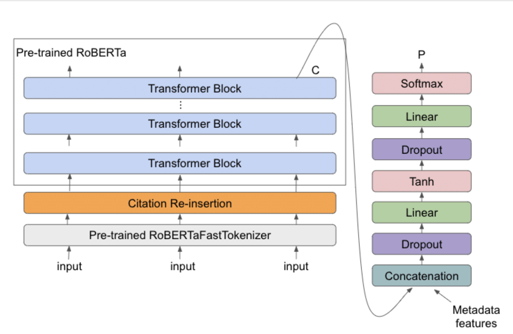
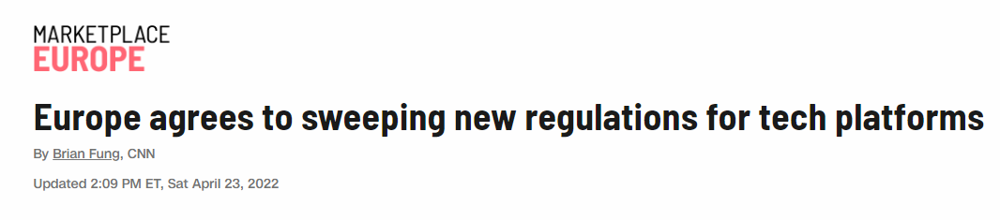

# Fake News Recognition

## Background

With the widespread use of various social software. Anyone can be a producer, carrier, and disseminator of information. Broadly speaking, any summary, paraphrase, or commentary on new emerging things can be considered news. In this wide range of information, there might be restorations of the original appearance of the events, and there might also be some biased or false information.

## Problem 
Most of the time, ordinary people do not have the channels and ability to distinguish the right and wrong information. However, when fake news reaches a certain scale of dissemination, it is very likely to cause huge losses to people or cause misunderstandings. For example, during the pandemic, if there is fake news claiming that a drug that is more harmful to people can protect people from the virus, then those who believe the news may suffer losses. Therefore, we want to provide a way to identify the possibility of fake news to prevent people from being misled by fake news.

Here is one example of fake news:

```
title:
Donald Trump Sends Out Embarrassing New Year's Eve Message; This is Disturbing

content:
Donald Trump just couldn t wish all Americans a Happy New Year and leave it at that. Instead, he had to give a shout out to his enemies, haters and  the very dishonest fake news media.  The former reality show star had just one job to do and he couldn t do it. As our Country rapidly grows stronger and smarter, I want to wish all of my friends, supporters, enemies, haters, and even the very dishonest Fake News Media, a Happy and Healthy New Year,  President Angry Pants tweeted.  2018 will be a great year for America! As our Country rapidly grows stronger and smarter, I want to wish all of my friends, supporters, enemies, haters, and even the very dishonest Fake News Media, a Happy and Healthy New Year. 2018 will be a great year for America!  Donald J. Trump (@realDonaldTrump) December 31, 2017Trump s tweet went down about as welll as you d expect.What kind of president sends a New Year s greeting like this despicable, petty, infantile gibberish? Only Trump! His lack of decency won t even allow him to rise above the gutter long enough to wish the American citizens a happy new year!  Bishop Talbert Swan (@TalbertSwan) December 31, 2017no one likes you  Calvin (@calvinstowell) December 31, 2017Your impeachment would make 2018 a great year for America, but I ll also accept regaining control of Congress.  Miranda Yaver (@mirandayaver) December 31, 2017Do you hear yourself talk? When you have to include that many people that hate you you have to wonder? Why do the they all hate me?  Alan Sandoval (@AlanSandoval13) December 31, 2017Who uses the word Haters in a New Years wish??  Marlene (@marlene399) December 31, 2017You can t just say happy new year?  Koren pollitt (@Korencarpenter) December 31, 2017Here s Trump s New Year s Eve tweet from 2016.Happy New Year to all, including to my many enemies and those who have fought me and lost so badly they just don t know what to do. Love!  Donald J. Trump (@realDonaldTrump) December 31, 2016This is nothing new for Trump. He s been doing this for years.Trump has directed messages to his  enemies  and  haters  for New Year s, Easter, Thanksgiving, and the anniversary of 9/11. pic.twitter.com/4FPAe2KypA  Daniel Dale (@ddale8) December 31, 2017Trump s holiday tweets are clearly not presidential.How long did he work at Hallmark before becoming President?  Steven Goodine (@SGoodine) December 31, 2017He s always been like this . . . the only difference is that in the last few years, his filter has been breaking down.  Roy Schulze (@thbthttt) December 31, 2017Who, apart from a teenager uses the term haters?  Wendy (@WendyWhistles) December 31, 2017he s a fucking 5 year old  Who Knows (@rainyday80) December 31, 2017So, to all the people who voted for this a hole thinking he would change once he got into power, you were wrong! 70-year-old men don t change and now he s a year older.Photo by Andrew Burton/Getty Images.
```

As is shown above, the main feature of fake news is to create a feeling for reader that counter common sense. So this model can be applied to the major social media to avoid damage from fake news as much as possible.

## Solution

Used a combined dataset from kaggle and dataset that scraped from new websites that is confirmed to be fake or real. Then select the pre-trained model "roberta-base" as the baseline, and fine tuning the model.

### RoBERTa
RoBERTa stands for **Robustly Optimized BERT Pre-training Approach**. The goal of the model was to optimize the training of BERT architecture in order to take lesser time during pre-training. **BERT**, which it based on uses static masking i.e. the same part of the sentence is masked in each Epoch. In contrast, RoBERTa uses dynamic masking, wherein for different epochs, different part of the sentences are masked.



### Fine Tuning

Fine tuning is when using a pretrained model, train it on a dataset specific to the task. The steps for fine tuning a pre_trained model can be given as follows:

1. Tokenize each sentence using RoBERTa 
2. Set training parameters
3. Train the model
4. Assess: Using ROC-AUC for this problem

### Challenge

The biggest challenge in this task is to get the correct label for each piece of news. As we can't verify news ourselves, I managed to choose news that is objective and has been confirmed or falsified.
     
## Result
Here is a recent new from CNN which is confirmed to be real, and we enter the text into our model.



[resources link:]: https://us.cnn.com/2022/04/23/business/eu-tech-regulation/index.html

|      | True Prob | Fake Prob |
| ---- | --------- | --------- |
| 0    | 0.9969    | 0.0031    |


## Critical Analysis

1. The current model can only take first 500 words in the text due to training resources. It might cause problems when a long text is entered into the model which context is highly relevant. 

2. When the input text is too short, it often judges it as fake news due to our strategy of truncating first 500 words and padding short text.

   ### Further improvement

   1. We may add more features such as title, author information to improve the model.      
   2. The current pre-trained model RoBERTa is still quite slow when trainning on big datasets. Probably we can try other models and compare the runtime and performance of the models.


## Hugging face links:

[Hugging face model card ](https://huggingface.co/jy46604790/Fake-News-Bert-Detect)

[Hugging face space](https://huggingface.co/spaces/jy46604790/Fake-News-Recognition)

## Resource links:

[Streamlit document](https://docs.streamlit.io/library/get-started/main-concepts)

[Hugging face tutorial](https://huggingface.co/docs/transformers/index)

[Kaggle Dataset](https://www.kaggle.com/datasets/clmentbisaillon/fake-and-real-news-dataset)

[RoBERTa: A Robustly Optimized BERT Pretraining Approach](https://huggingface.co/docs/transformers/model_doc/roberta)

## Demonstration links:

[Repo](https://github.com/Jiayif/Transformer-Fake-News-Detection/)

[Youtube]()
